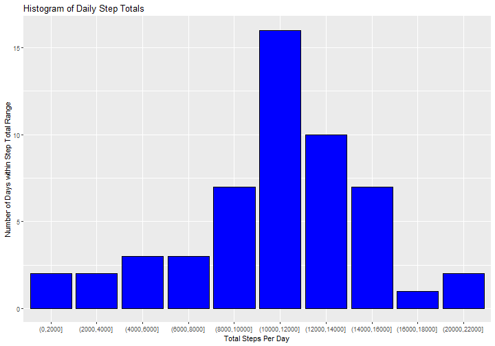
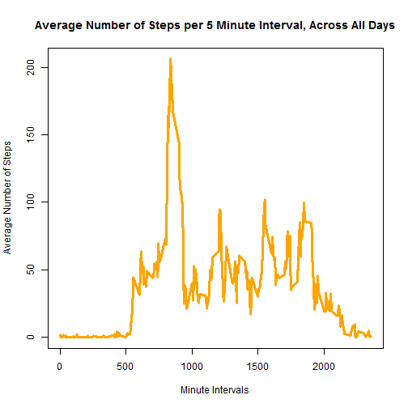
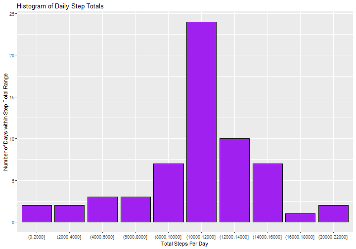
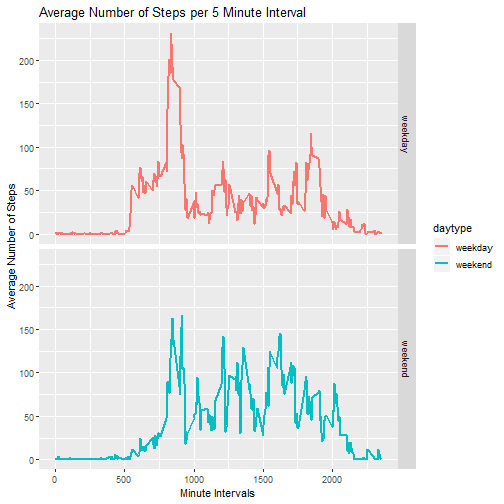

## Loading and preprocessing the data


```r
library(tidyverse)
unzip("activity.zip")
actdat <- read.csv("activity.csv", stringsAsFactors = FALSE)
actdat$date <- as.Date(actdat$date, "%Y-%m-%d")
```

## What is the mean total number of steps taken per day?

**1. Calculate the total number of steps taken per day.**


```r
sumdat <- actdat %>%
    filter(!is.na(steps)) %>%
    group_by(date) %>%
    summarise(totsteps = sum(steps)) %>%
    ungroup(sumdat)
```


**2. Make a histogram of the total number of steps taken per day.**


```r
sumdat$cut <- cut(sumdat$totsteps, seq(0, 22000, by = 2000), dig.lab = 5)
ggplot(sumdat, aes(x = cut)) +
    geom_histogram(stat = "count", color = "black", fill = "blue") +
    labs(title = "Histogram of Daily Step Totals", x = "Total Steps Per Day",
         y = "Number of Days within Step Total Range")
```




**3. Calculate the mean and median of the total number of steps taken per day.**


```r
noNAmean <- mean(sumdat$totsteps)
noNAmedian <- median(sumdat$totsteps)
paste("mean:", noNAmean)
```

```
## [1] "mean: 10766.1886792453"
```

```r
paste("median:", noNAmedian)
```

```
## [1] "median: 10765"
```

## What is the average daily activity pattern?

**1. Make a time series plot of the 5-minute interval (x-axis) and the average 
number of steps taken, averaged across all days (y-axis).**


```r
avgdat <- actdat %>%
    filter(!is.na(steps)) %>%
    group_by(interval) %>%
    summarise(avsteps = mean(steps)) %>%
    ungroup(avgdat)

plot(avgdat$interval, avgdat$avsteps, 
     type = "l",
     main = "Average Number of Steps per 5 Minute Interval, Across All Days",
     xlab = "Minute Intervals",
     ylab = "Average Number of Steps",
     col = "orange",
     lwd = 3)
```




**2. Which 5 minute interval, on average across all the days in the dataset,
contains the maximum number of steps?**


```r
int <- avgdat$interval[which(avgdat$avsteps == max(avgdat$avsteps))]
paste("Interval", int)
```

```
## [1] "Interval 835"
```

## Imputing Missing Values

**1. Calculate and report the total number of missing values in the dataset 
(i.e. the total number of rows with NAs).**


```r
missin <- sum(is.na(actdat$steps))
paste("Number of missing values:", missin)
```

```
## [1] "Number of missing values: 2304"
```


**2. Devise a strategy for filling in all of the missing values in the datasets
and 3. Create a new dataset that is equal to the original dataset but with the
missing values filled in.**


```r
#replaces NAs with the mean of that interval across all days#
meanfill <- function(x) {
    replace(x, is.na(x), mean(x, na.rm = TRUE))
}

impdat <- actdat %>%
    group_by(interval) %>%
    mutate(steps = meanfill(steps)) %>%
    ungroup(impdat)

print(impdat)
```

```
## # A tibble: 17,568 x 3
##     steps date       interval
##     <dbl> <date>        <int>
##  1 1.72   2012-10-01        0
##  2 0.340  2012-10-01        5
##  3 0.132  2012-10-01       10
##  4 0.151  2012-10-01       15
##  5 0.0755 2012-10-01       20
##  6 2.09   2012-10-01       25
##  7 0.528  2012-10-01       30
##  8 0.868  2012-10-01       35
##  9 0      2012-10-01       40
## 10 1.47   2012-10-01       45
## # ... with 17,558 more rows
```


**4. Make a histogram of the total number of steps taken each day and calculate 
and report the mean and median total number of steps taken per day. Do these 
values differ from the estimates from the first part of the assignment? 
What is the impact of imputing missing data on the estimates of the total 
daily number of steps?**


```r
sumdat2 <- impdat %>%
    group_by(date) %>%
    summarise(totsteps = sum(steps)) %>%
    ungroup(sumdat2)

sumdat2$cut <- cut(sumdat2$totsteps, seq(0, 22000, by = 2000), dig.lab = 5)
ggplot(sumdat2, aes(x = cut)) +
    geom_histogram(stat = "count", color = "black", fill = "purple") +
    labs(title = "Histogram of Daily Step Totals", x = "Total Steps Per Day",
         y = "Number of Days within Step Total Range")
```


*When we add in the imputed values, we see more days with higher step totals 
than we saw when we excluded the missing values.*  
  


```r
impmean <- mean(sumdat2$totsteps)
impmedian <- median(sumdat2$totsteps)

diffs <- data.frame(BeforeImpute = c(noNAmean, noNAmedian), 
                    AfterImpute = c(impmean, impmedian))
row.names(diffs) <- c("Mean", "Median")
print(diffs)
```

```
##        BeforeImpute AfterImpute
## Mean       10766.19    10766.19
## Median     10765.00    10766.19
```
*However, because we used the interval mean to impute the missing values, the 
mean is unchanged and the median is almost unaffected.*  
  

## Are there differences in activity patterns between weekdays and weekends?

**1. Create a new factor variable in the dataset with two levels - "weekday" and 
"weekend" indicating whether a given date is a weekday or weekend day.**


```r
impdat$day <- weekdays(impdat$date)
impdat$daytype <- ifelse(impdat$day == "Saturday"|impdat$day == "Sunday", 
                         "weekend", "weekday")
impdat$daytype <- as.factor(impdat$daytype)
```


**2. Make a panel plot containing a time series plot of the 5-minute interval 
(x-axis) and the average number of steps taken, averaged across all weekday 
days or weekend days (y-axis).**


```r
avgdat2 <- impdat %>%
    group_by(daytype, interval) %>%
    summarise(avsteps = mean(steps)) %>%
    ungroup(avgdat2)

ggplot(avgdat2, aes(interval, avsteps)) +
    geom_line(aes(color = daytype), size = 1) +
    facet_grid(daytype ~ .) +
    labs(title = "Average Number of Steps per 5 Minute Interval", x = "Minute Intervals",
         y = "Average Number of Steps")
```


